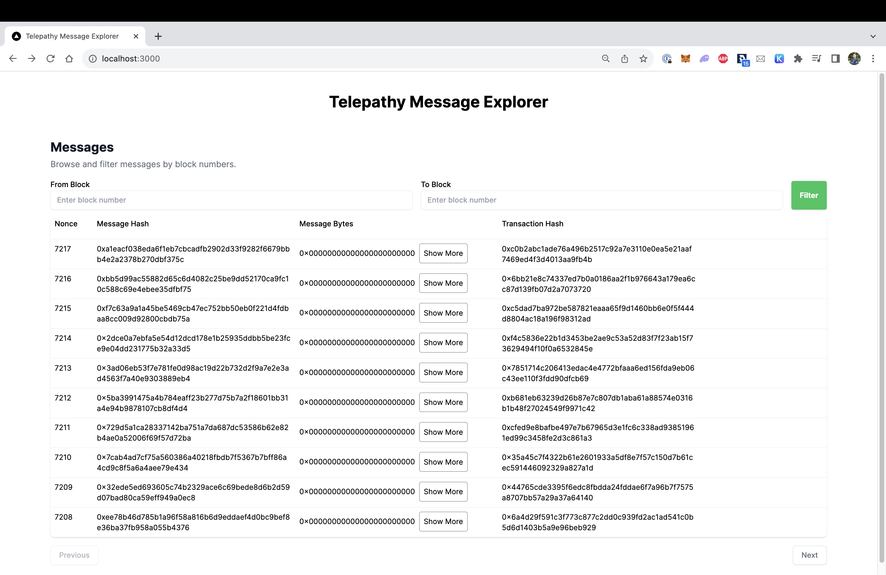
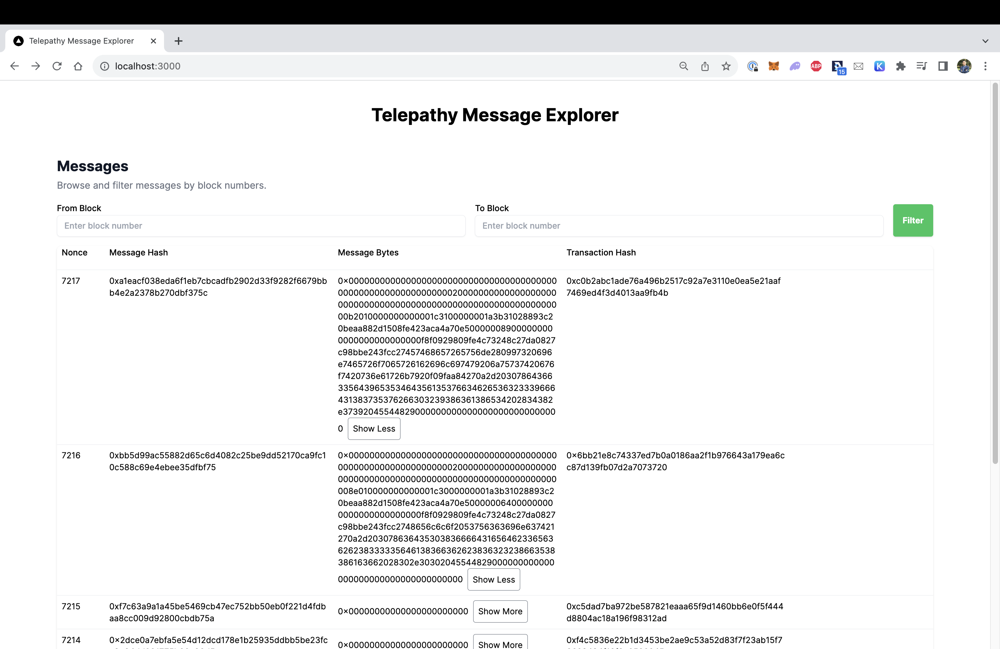
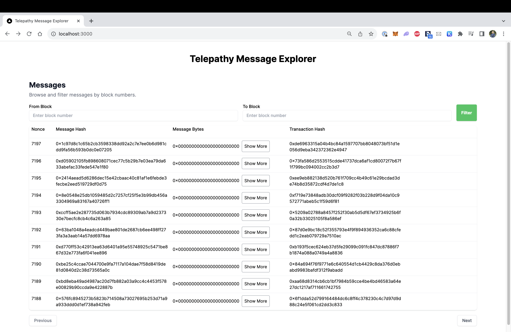
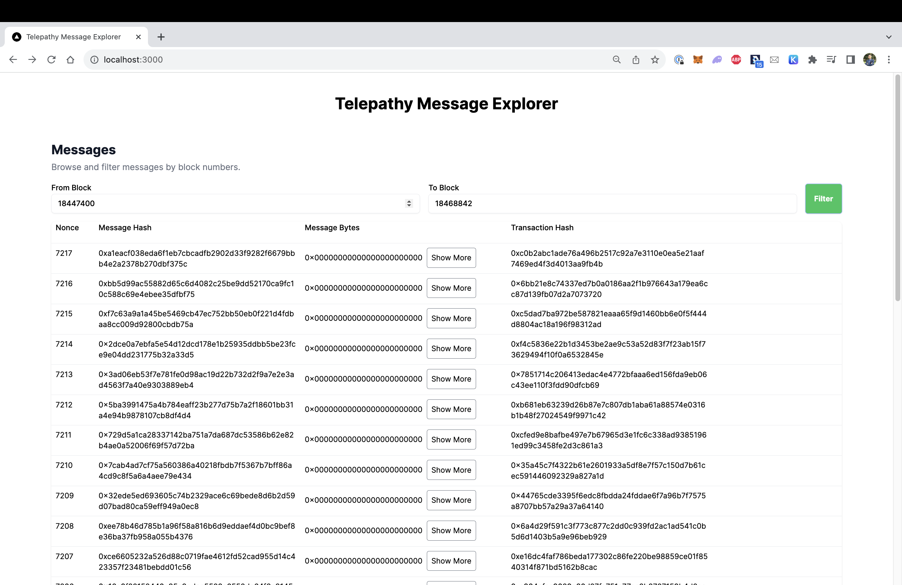

# Telepathy Message Explorer

A message explorer for the Telepathy protocol. View sent messages alongside metadata relevant to that sent message in a paginated table.

Note: We minimize the number of RPC calls thanks to some caching.
Extra: You can filter to only show messages between 2 blocks from messages you've already seen.

## Screenshots and Demo Video

[Demo Video](./telepathy_demo.mov)
telepathy_demo.mov contains the demo video.

## Getting Started

- Remove the `.example` suffix from `.env.local.example`. You can replace the API URL with another if you'd like.
- Run the development server using `npm install && npm run dev`
- Open [http://localhost:3000](http://localhost:3000) with your browser to see the result.
